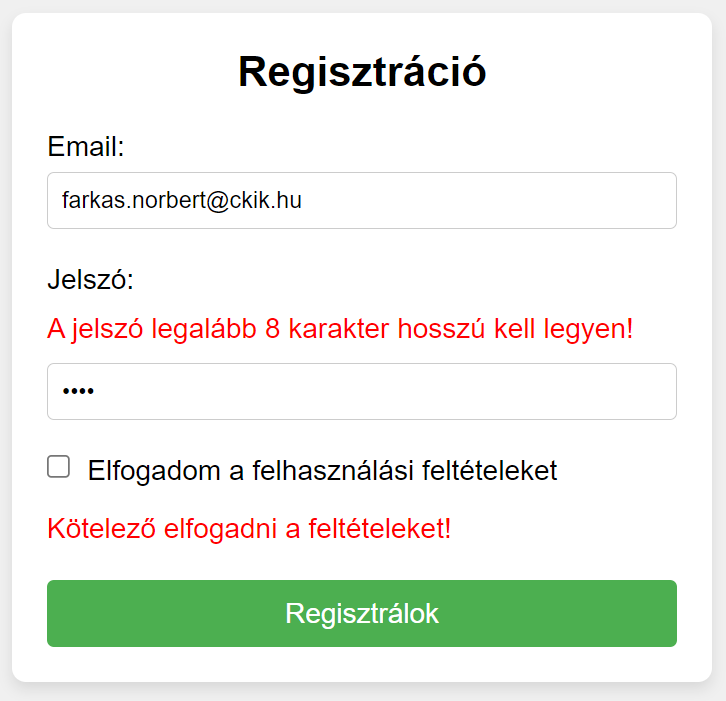
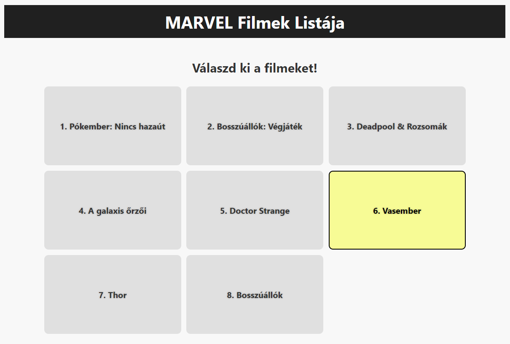
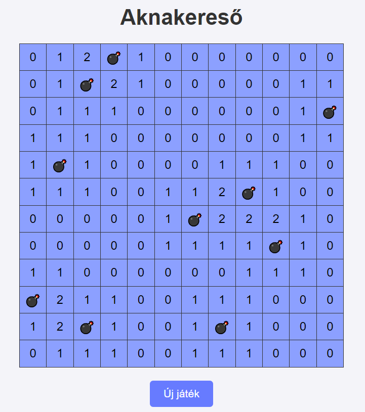
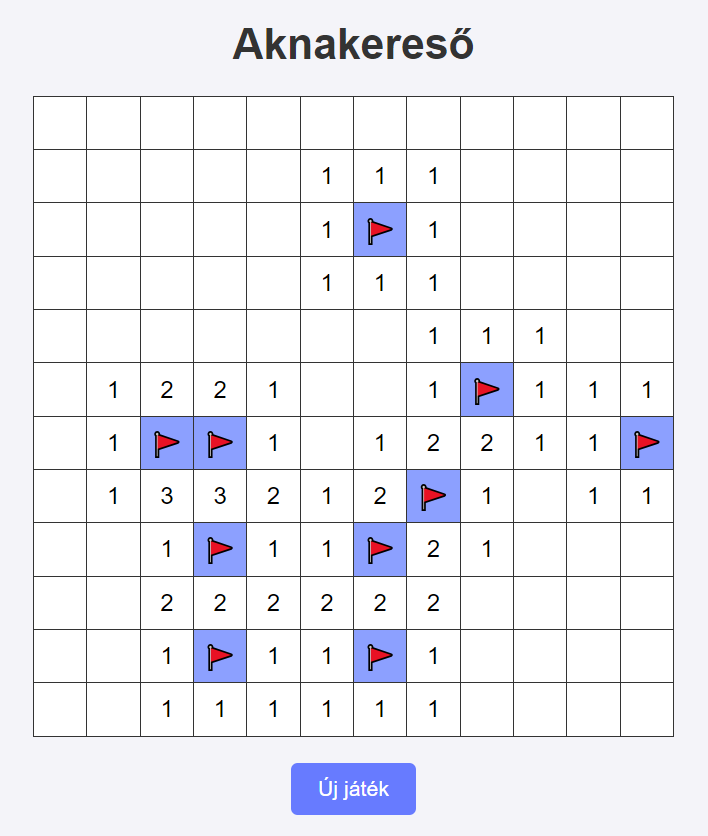

# 1. Delegálás

1. **Elfogadom.** A regisztrációs gombra kattintva ellenőrizd, hogy elfogadtuk-e a feltételeket! `checkData()`
   
    a. Ha nincs kipipálva a checkbox, akkor jelenítsd meg a `terms-message` üzenetet! Ebben az esetben az űrlapot ne küldjük el!

    b. Ellenőrizd a jelszó hosszát is, amely legalább 8 karakter kell legyen! **HF**

    

        
    

## Események buborékolódása
Az eseményekre nem csak azok a HTML elemek tudnak reagálni, akikkel közvetlen történt, hanem az őseik is! Ez a jelenség az **event bubbling**.

Ezáltal különbség van az eseményt kiváltó elem (`event.target`) és az eseményt kezelő elem (`event.currentTarget`) között.

**Delegálás**nak nevezzük azt a technikát, amikor egy eseményt nem a kiváltó elem szintjén, hanem valamelyik ős elem szintjén kezelünk.

2. **Marvel.** Készíts alkalmazást, amellyel sorba rendezhetjük kedvenc Marvel filmeinket!

    a. Amikor egy filmre kattintunk, írd ki a címét a konzolra! Ellenőrizd, hogy biztosan lista elemre kattintottunk-e!

    b. Szeretnénk megcserélni két filmet. Az első kattintásnál tárold el az első `li` elemet, a másodiknál pedig cseréld meg az előzőleg tárolt elemmel! Ügyelj rá, hogy a cserék egymás után többször is végrehajthatóak legyenek! `swapMovies(listItem1, listItem2)`

    c. Ne az elemek teljes tartalmát cseréld, csak a filmek címét!

    d. Animáld a cseréket! Egy elem kiválasztásakor adjunk neki `selected` osztályt! Amikor helyet cserél két felsorolás elem, akkor alkalmazd rájuk a `swap` css osztályt!

    e. Az animációt követően távolítsd el róluk a `selected` osztályt! `afterAnimation()`

    

        
    

3. **Aknakereső.** Készíts egy aknakereső játékot!

    a. A játék kezdetén tölts fel egy táblázatot aknamezőkkel. `startGame()`, `createBoard()`, `showBoard()`
    
    Egy mező tulajdonságai:
    - `value`: hány akna veszi körül (number)
    - `isMine`: akna-e a mező (bool)

    b. Válaszd ki az aknák helyét véletlenszerűen, és tárold el, hogy az egyes mezők szomszédaiban hány akna található! `generateMines()`

    A táblázat celláiban az aknák helyén egy  💣 karaktert jeleníts meg!

    

        
    

    c. Tartozzon a mezőkhöz egy `isRevealed` tulajdonság is, amely azt mutatja, hogy felfedtük-e a már a mezőt.
    
    Amikor a táblázat egy cellájára kattintunk, fedd fel az aktuális mezőt, majd rajzold ki újra a táblázatot! `handleClick()`

    Amíg nem fedtünk fel egy mezőt, az értéke nem látható a táblázatban. Utána viszont a bomba és a 0-tól különböző értékűek láthatóak lesznek! A felfedett cellák kapjanak `revealed` css osztályt is!

    d. Egy mező felfedését követően ellenőrizzük, hogy győztünk vagy vesztettünk-e! Akna felfedése automatikus vesztés, ha pedig már csak az aknákat nem fedtük fel, akkor nyertünk! `revealField(i, j)`, `checkGameEnd(i, j)`

    Ha véget ért a játék, akkor ne reagáljunk a továbbiakban táblázat cellákon történő kattintásokra!

    e. A egér jobb gombjának lenyomásával tudjunk 🚩 jeleket elhelyezni a táblán! Tároljuk el, hogy melyik mezők vannak megjelölve egy `isFlagged` tulajdonsággal!
    
    - Ha zászlót tartalmazó cellára kattintunk ismét jobb gombbal, akkor távolítsuk el onnan a jelet!
    - Csak olyan mezőre tehessünk zászlót, ami még nincs felfedve!
    - Zászlót tartalmazó mezőt ne tudjuk felfedni!

    

        
    

    f. A felhasználói élmény növelése érdekében üres mezőre kattintáskor fedjük fel annak szomszédait is automatikusan! `revealNeighbors(x, y)`

    g. Vesztés esetén indítsunk el egy robbanás hangot! Ingyenes hangok: [Pixabay](https://pixabay.com/sound-effects/search/explosion/)