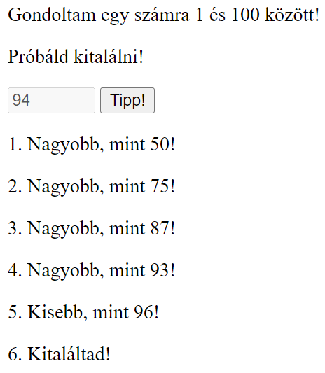

# 2. DOM, események

1. **Gondoltam.** Készíts egy számkitalálós játékot!

    a. Generálj 1 és 100 között egy számot véletlenszerűen!

    b. Tippeléskor (gomb kattintásra) jelezd a játékosnak, hogy az általa megadott számhoz képest kisebb vagy nagyobb a kitalálandó szám!

    c. A szám kitalálását követően a gomb ne működjön, a beviteli mező legyen inaktív!

    <p align="center">
    
    </p>

2. **Kő, papír, olló.** Csinálj egy kő-papír-olló játékot! Az ellenfél a számítógép legyen!

    a. Mikor egy tárgyra kattintunk a hozzá tartozó kép kapjon `active` osztályt! Ezt követően ne reagáljunk kattintásokra!

    b. Készíts `randomItem()` néven függvényt, amely visszatérési értéke `ko` vagy `papir` vagy `ollo` (egyforma valószínűséggel)!

    c. A számítógép választásának megfelelő tárgy (kép) kerüljön be az `eredmeny` azonosítójú bekezdés elé!

    d. Írj függvényt `decideWinner(human, computer)` néven, amely paraméterként megkapja a játékos és a számítógép által választott tárgyakat, és visszatérési értéke az eredmény! (Számítógép nyert! / Játékos nyert! / Döntetlen!)

    <p align="center">
    
    </p>

3. **Hello.** Köszönjünk az oldal látogatójának!
   
    a. Miután megadja a felhasználó a nevét (gombra kattintás), tüntessük el a form elemeket, és köszöntsük a felhasználót!

    b. Tároljuk el a felhasználó által megadott nevet!

    c. Az oldal betöltésekor vizsgáljuk meg, hogy régi vagy új látogatónk van! A régieket ne a form fogadja, hanem automatikusan köszöntsük őket!

    d. Fejlesszük tovább az oldalt, hogy a felhasználók első alkalommal megadhassák azt is, hogy milyen formában szeretnék a köszöntést. Például:

    ```html
    <label>Hogyan köszöntselek?</label>
    <select>
        <option value="1">Szia</option>
        <option value="2">Hello</option>
        <option value="3">Szép napot</option>
        <option value="4">Jó napot</option>
    </select>
    ```

    e. Tároljuk a köszöntést és a felhasználó nevét egyetlen objektumként (egységbe zárás)!

    f. Törekedjünk a kód tisztaságára!

    <p align="center">
    
    </p>
