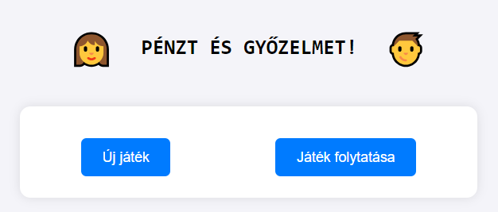
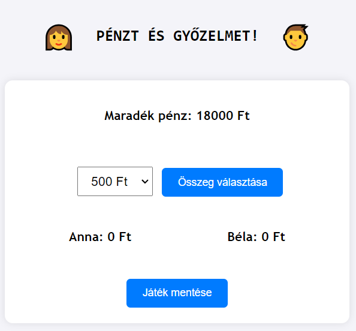
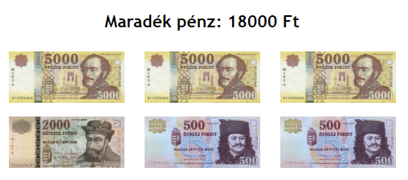
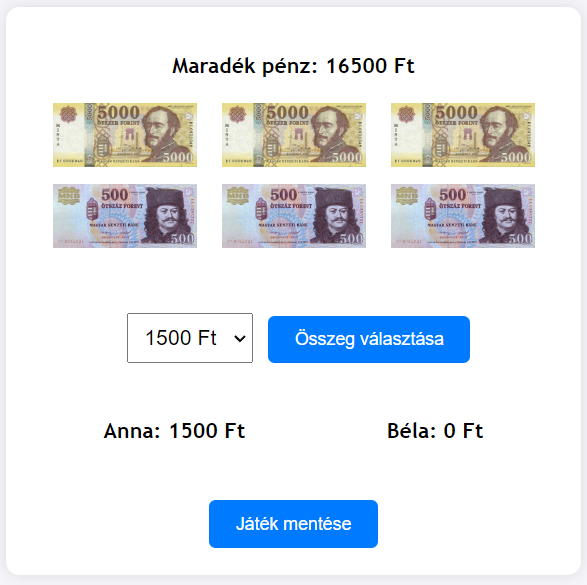
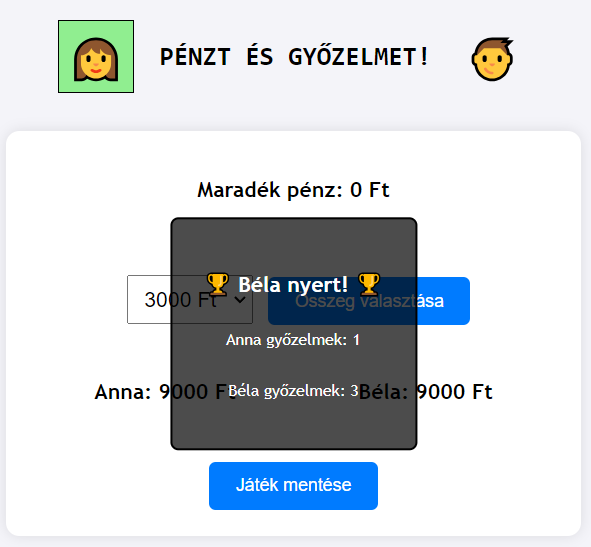

# Pénz és győzelem

Anna és Béla egy játékot játszanak. Kezdetben az asztalon van valamennyi pénz, és felváltva vesznek el belőle 500 Ft és 3000 Ft közötti értéket, de csakis 500-zal oszthatót! A győztes aki  az utolsó pénzt el tudja venni!

<p align="center">
    
</p>

Készítsd el a játékot az alábbi leírás alapján! A változók neveit tetszőlegesen megválaszthatod, de a **függvények neveit pontosan a feladatok szerint** add meg!

0. A játék aktuális állapotát 4 változóval tudjuk leírni:

    - Mennyi pénz van jelenleg az asztalon? `currentMoney`
    - Mennyi pénzt vett el eddig Anna? `annaMoney`
    - Mennyi pénzt vett el eddig Béla? `belaMoney`
    - Ki a következő játékos? (Pl.: 1 = Anna, 2 = Béla) `player`

    Ezeket javasolt globálisan deklarálni és kezdőértéket adni nekik!

1. Az asztalon lévő pénz kezdőértéke 15000 Ft és 20000 Ft közötti véletlenszerű érték legyen, de csakis 1000-rel osztható! (Tehát összesen 6 fajta lehetőségünk van.)

2. Az "Új játék" nevű gombra kattintáskor indítsuk el a játékot. Az eseménykezelő neve `startGame()` legyen! Feladatai a következők:

    a. A `modes` osztályba tartozó elemet rejtsük el, a `game` osztályba tartozót jelenítsük meg!

    b. Kiírja az állapotot leíró változókat a megfelelő helyre! (Mennyi pénz van az asztalon, Annánál, Bélánál?)

    c. Meghív egy `renderMoney()` nevű függvényt, amelyet a következő feladatban kell megírni!

    <p align="center">
    
    </p>

3. A `renderMoney()` az asztalon lévő összeget jeleníti meg 5000 Ft, 2000 Ft és 500 Ft-os címletekkel egy listában képeket generálva!

    Ehhez használd fel a `money-types` mappában található képeket!

    Ügyelj rá, hogy a lehető legkevesebb képet jelenítsd meg! Például a mintában látható 18000 Ft esetén ne 36 darab 500 Ft-os címletet jeleníts meg, hanem:
    - 3 darab 5000 Ft
    - 1 darab 2000 Ft
    - 2 darab 500 Ft

    Tehát a nagy címleteket használd ameddig csak lehet, majd utána jöhetnek a kisebbek!

    <p align="center">
    
    </p>

4. Bővítsd a `startGame()` függvényt, hogy az "Összeg választása" gombra kattintva egy `takeMoney()` nevű eseménykezelő fusson le!

    a. Olvassa ki a választott összeget!

    b. Ha ez több, mint az asztalon lévő összeg, akkor ne tegyen semmi mást! Egyéb esetben az asztalon lévő összeg csökkenjen, az aktuális játékos összege pedig növekedjen a választott értékkel!

    c. Ügyelj arra is, hogy ne csak a JavaScript változók értékeit módosítsd, hanem a felhasználó is láthassa a változásokat! Az asztalon lévő pénzt is újra jelenítsd meg!

    <p align="center">
    
    </p>

5. Vizuálisan is jelezd, hogy melyik játékos következik! Az oldal tetején látható ikonok közül a megfelelő kapjon `current-player` osztályt! Ügyelj rá, hogy ez már a kezdő játékos esetében is megtörténjen!

6. Miután egy játékos sikeresen elvett valamennyi pénzt, ellenőrizzük, hogy véget ért-e a játék! Ha igen, akkor a `winner` osztályba tartozó elemhez rendeljük hozzá a `show` osztályt is! Írjuk bele azt is, hogy ki nyert!

7. A "Játék mentése" gombra kattintva egy `saveGame()` eseménykezelő segítségével mentsük el a játék aktuális állapotát `localStorage`-ban!

8. Ha kezdetben az "Új játék" helyett a "Játék folytatása" gombot választjuk, akkor egy `loadGame()` eseménykezelő függvény olvassa ki a `localStorage`-ból a játék állapotát, majd annak megfelelően kezdődjön el a játék! Ügyelj arra is, hogy ha nincs elmentett játék, akkor ne csináljon semmit a betöltés!

9. Szeretnénk a korábbi játékokról is adatokat tárolni `localStorage`-ban!

    a. Amikor egy játék véget ér, akkor rögzítsd az eredményét (Ki nyert? Mennyit?) egy listában objektumként! Pl.:
    ``` js
    games = [
        { winner: "Béla", money: 7000 },
        { winner: "Anna", money: 9000 },
        { winner: "Béla", money: 6000 },
        { winner: "Béla", money: 9000 }
    ];
    ```

    b. A tömböt tárold el `localStorage`-ban, és az oldal betöltésekor olvasd ki a korábban tárolt adatokat! Ismét figyelj rá, hogy az első játék előtt nincsenek még elmentett adataink!

    c. Győzelem esetén jelenítsd meg azt is, hogy Anna és Béla az eddigi játékok során összesen hányszor nyert!

    <p align="center">
    
    </p>
